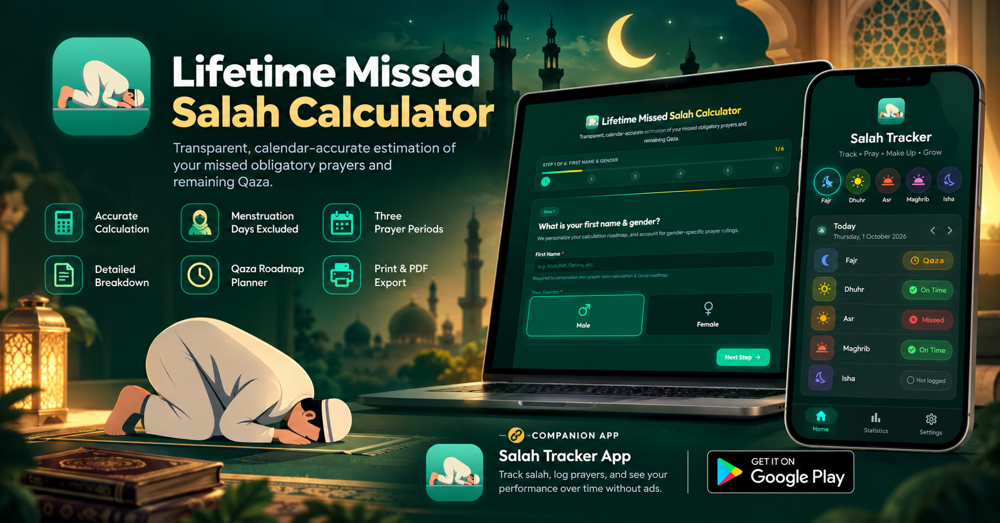

# Lifetime Missed Salah & Qaza Calculator

  

  <strong>A transparent, spiritually serene, and calendar-accurate calculator for lifetime missed obligatory prayers (Salah) and outstanding debt (Remaining Qaza).</strong>

  

---

## 🌟 Overview

The **Lifetime Missed Salah & Qaza Calculator** is a privacy-first web application designed to help Muslims transparently calculate their lifetime missed obligatory prayers and systematically plan their journey of making them up (*Qaza*).

Rather than relying on rough estimates or crude 365-day approximations, the calculator models a user's lifetime prayer behavior across specific phases of their life with exact day-by-day calendar arithmetic, personalized biological factors (including menstruation deduction for women), and full mathematical transparency.

---

## ✨ Key Features

### 🧮 1. Multi-Period Prayer Behavior Modeling
Accounts for how prayer habits change over a lifetime:
- **Regularly Prayed Period**: Years, months, and days where all 5 daily prayers were performed (0 missed).
- **Partially Prayed Period**: Timeframes where some prayers were offered, with customizable daily missed rates (1, 2, 3, or 4 missed per day).
- **No-Prayer Period**: Automatically computed remaining duration where no prayers were offered (5/5 missed per day).

### 🗓️ 2. Exact Calendar Arithmetic
- Operates on precise calendar dates from date of birth up to the current day.
- Properly accounts for leap years, variable month lengths (28, 29, 30, and 31 days), and elapsed calendar durations.
- Automatically calculates the age of puberty/accountability (*Baligh* / *Bulugh*) based on Islamic principles (defaulting to 15 lunar/solar years or custom maturity age).

### 🌸 3. Biological Exemptions (Menstruation Deduction)
- For female users, the calculator factors in monthly periods of ritual exemption (*Hayd*).
- Accurately deducts non-obligatory days ($Total\ Months \times Average\ Cycle\ Days$) from the total obligation, preventing overcounting.

### 📊 4. Lifetime Missed vs. Remaining Qaza
- **Lifetime Missed Salah**: The historical total of prayers originally missed during partial and no-prayer periods.
- **Qaza Already Prayed**: Make-up prayers already completed to date.
- **Remaining Qaza**: The actual outstanding balance of prayers still requiring completion.
- **Equivalent Duration**: Instantly converts remaining prayers into years, months, and days of all 5 daily prayers.

### 🔍 5. 100% Transparent Step-by-Step Audit Trail
- Includes an expandable *"How was this calculated?"* drawer detailing all 7 mathematical calculation steps with exact figures.
- Provides complete clarity and confidence in how every single prayer number is derived.

### ⚡ 6. Instant Recalculation Drawer
- A side slide-over drawer allows users to adjust any parameter (dates, puberty age, prayer habits, cycles, or make-up count) and observe real-time updates across the dashboard without resetting the form.

### 📅 7. Qaza Roadmap Planner
- Interactive pace selector with 4 commitment tiers:
  - **Gentle Pace**: 1 Qaza per day
  - **Balanced Pace**: 5 Qaza per day (1 with each daily prayer)
  - **Dedicated Pace**: 10 Qaza per day (2 with each daily prayer)
  - **Intensive Pace**: 20 Qaza per day (4 with each daily prayer)
- Computes estimated completion milestones, projected finish dates, and itemized breakdowns for each individual prayer (Fajr, Dhuhr, Asr, Maghrib, Isha, and optional Hanafi Witr).

### 💾 8. Local Storage Cache Persistence
- Automatically saves all form inputs, date entries, selections, and step progress locally in your browser (`localStorage`).
- Refreshing or accidentally closing the browser page will not reset your progress or lose your entered data.
- Instantly restores you to your active wizard step or your calculated results dashboard upon reloading.
- Includes a dedicated **Clear Data** action button for complete privacy control and fresh resets.

### 🎨 9. High-Contrast Dark Theme & Clean Print/PDF Export
- Crafted with modern Islamic emerald, deep spruce, and radiant gold tones.
- Optimized `@media print` stylesheets preserve the dark aesthetic for full-page PDF exports and printed audit reports.
- Includes a one-click summary copy tool for easy personal note-keeping.

---

## 📱 Companion Mobile App: Salah Tracker

To seamlessly log your daily obligatory prayers in real time and track your remaining Qaza step-by-step from your phone, pair this calculator with the **Salah Tracker** Android app:

  

  <a href="https://play.google.com/store/apps/details?id=com.sahed.salah_tracker" target="_blank" rel="noopener noreferrer">
    <strong>📲 Download Salah Tracker on Google Play Store</strong>
  </a>

- **Real-Time Daily Tracking**: Mark Fajr, Dhuhr, Asr, Maghrib, and Isha as you pray them throughout the day.
- **Live Qaza Counter**: Decrement your remaining Qaza prayer balance one by one with a single tap.
- **Streaks & Habits**: Build lasting prayer discipline with streaks, statistics, and achievement milestones.
- **Smart Reminders**: Receive gentle, timely notifications so you never miss an obligatory or make-up prayer.

---

## ⚖️ Religious Disclaimer

This calculator provides an estimation based on the inputs provided by the user. Scholarly opinions and jurisprudential schools (*madhahib*) may differ on specific rulings concerning puberty milestones, missed prayers, menstruation allowances, and the obligation of make-up prayers (*Qada/Qaza*). Users are encouraged to consult a trusted Islamic scholar regarding their specific personal circumstances.

---

## 👨‍💻 Author

Designed & Developed by **[Sahed Alom Sumit](https://sahedalomsumit.com/)**
